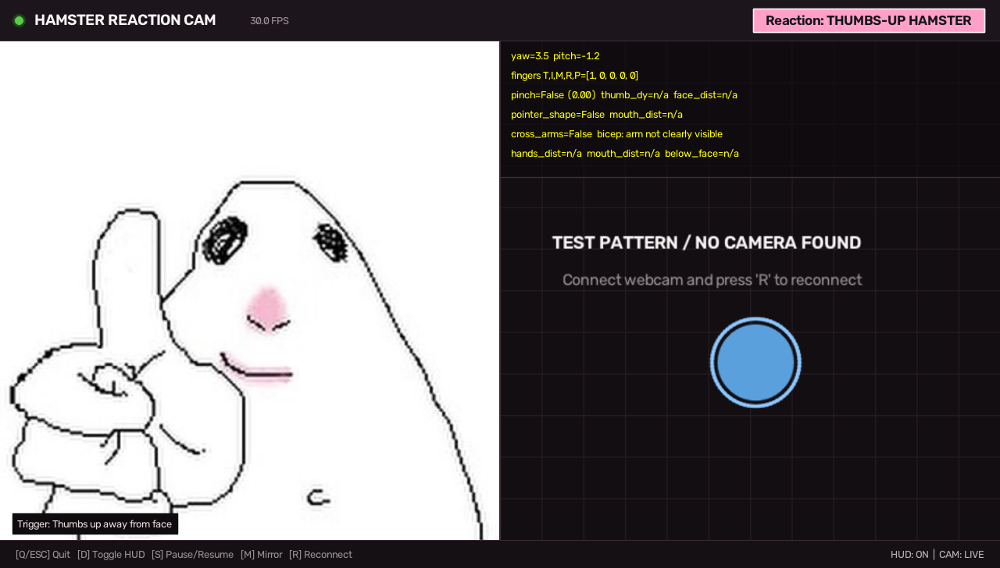

# 🐹 HAMMY.EXE

### your webcam is now hamster-controlled.

A goofy browser-based webcam playground where your gestures make a white meme hamster react.

🚀 **Live Demo** → [https://hammy-exe.vercel.app/](https://hammy-exe.vercel.app/)  
💻 **GitHub** → [https://github.com/Prashantsays69/hammy-exe](https://github.com/Prashantsays69/hammy-exe)



---

## what is this?

Make a face. Do a gesture.  
Hammy judges you.

HAMMY.EXE uses browser-based computer vision (MediaPipe) to track your face, hand gestures, and head posture in real time—instantly switching between goofy white meme hamster reactions to match your mood. Everything runs client-side directly in your browser.

---

## ✨ features

- 🐹 **15 meme hamster reactions** — from classic thumbs-up to Discord Mod glasses, chin-thinking, and swole flexing
- 📸 **Live webcam interaction** — real-time video feed with toggleable neon landmark skeleton and mirror mode
- ✋ **Hand gesture detection** — recognizes fingers, pinches, fists, and arm poses simultaneously
- 🙂 **Face & posture tracking** — tracks side-eye head turns, tilted head sadness, and cheek holding
- 🧠 **HAMMY BRAIN.exe** — retro terminal HUD showing live vision signals, confidence scores, and unhinged verdicts
- 📖 **Reaction collection system** — polaroid stamp album that unlocks and saves discovered moods to local storage
- 🥚 **Hidden hamster easter eggs** — 5 secret hamsters tucked around the site with sound effects
- 🎵 **Audio & sound effects** — includes optional sped-up HAMMY RADIO music, pop clicks, and squeaks
- 📱 **Responsive interface** — clean comic-scrapbook aesthetic designed for both desktop and mobile

---

## 🎭 gestures

| Gesture | Hammy reaction |
| :--- | :--- |
| Fist beside head / ear | LOLLIPOP JOY! 🍭 |
| Thumbs up | HAPPY HAMMY 👍 |
| Thumbs down | DISAPPOINTED HAMMY 👎 |
| Pinch near eyes / face | DISCORD MOD GLASSES 🤏 |
| Finger against lips | SHH HAMMY 🤫 |
| Pointing index finger up | NERD HAMSTER ☝️ |
| Flexing bicep | SWOLE HAMMY 💪 |
| Crossing arms over chest | NOPE HAMMY 🙅 |
| Cupping hands on cheeks | SHY HAMMY 🥺 |
| Hands clasped under chin | PONDERING HAMMY 🤔 |
| Hands together at chest | HUG HAMMY 🤗 |
| Tilting head down | SAD HAMMY 🙇 |
| Both hands raised | TRUCK HAMMY 🚚 |
| Turning head sideways | SIDE-EYE HAMSTER 👀 |
| Nothing (blank stare) | POKER-FACE HAMMY 😐 |

---

## 🛠️ built with

- **React** (v19)
- **Vite**
- **JavaScript**
- **MediaPipe Tasks Vision**
- **CSS** (comic design system)

All computer vision inference runs client-side inside your browser via WebAssembly—no webcam footage or personal data is ever sent to a server.

---

## 🚀 run locally

```bash
cd web
npm install
npm run dev
```

Open `http://localhost:5173` in your browser.

*(Optional)* The repository also includes a standalone Python desktop version using OpenCV:
```bash
pip install -r requirements.txt
python main.py
```
